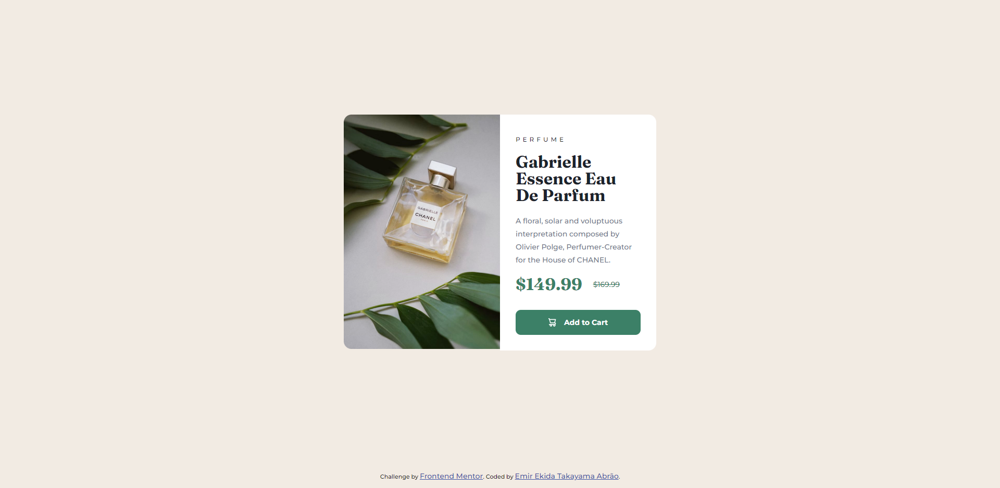

# Frontend Mentor - Product preview card component solution

This is a solution to the [Product preview card component challenge on Frontend Mentor](https://www.frontendmentor.io/challenges/product-preview-card-component-GO7UmttRfa). Frontend Mentor challenges help you improve your coding skills by building realistic projects. 

## Table of contents

- [Overview](#overview)
  - [The challenge](#the-challenge)
  - [Screenshot](#screenshot)
  - [Links](#links)
- [My process](#my-process)
  - [Built with](#built-with)
  - [What I learned](#what-i-learned)
  - [Continued development](#continued-development)
  - [Useful resources](#useful-resources)
- [Author](#author)
- [Acknowledgments](#acknowledgments)

## Overview
### The challenge

Users should be able to:

- View the optimal layout depending on their device's screen size
- See hover and focus states for interactive elements

### Screenshot

### Links

- Solution URL: [https://www.frontendmentor.io/solutions/responsive-landing-page-css-hover-media-queries-1cgNBlnbde](https://www.frontendmentor.io/solutions/responsive-landing-page-css-hover-media-queries-1cgNBlnbde)
- Live Site URL: [https://swaveng.github.io/product-preview-card-component-main/](https://swaveng.github.io/product-preview-card-component-main/)

## My process

### Built with

- Semantic HTML5 markup
- CSS custom properties
- Flexbox
- CSS Grid
- Mobile-first workflow
- Media queries

### What I learned

I learned nothing, but i put in practice my knowledge that i learned in other place. It was a good practice.

Update*: With the feedback i learned that using html ``<picture>`` tag is better than using css ``background-image`` to put various image because accessibility. 

## Author

- Website - [Emir Ekida Takayama Abrão](https://linktr.ee/emirng)
- Frontend Mentor - [@ngemir](https://www.frontendmentor.io/profile/ngemir)
- Twitter - [@NgEmir_](https://twitter.com/NgEmir_)
